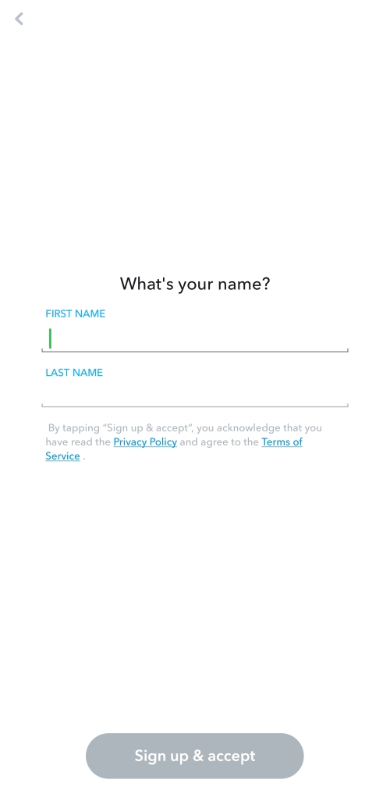
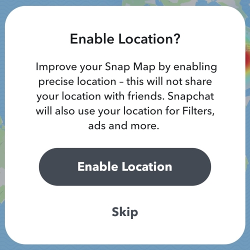
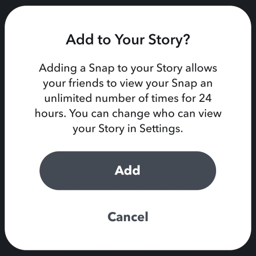
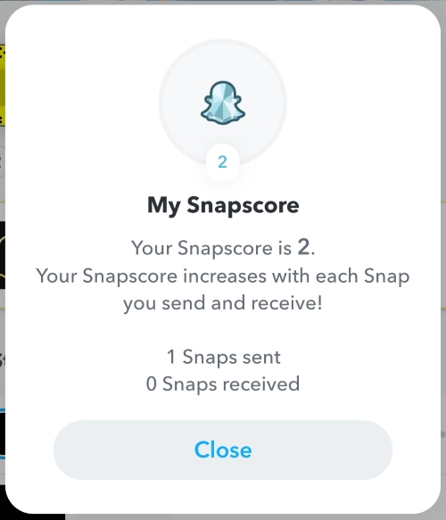
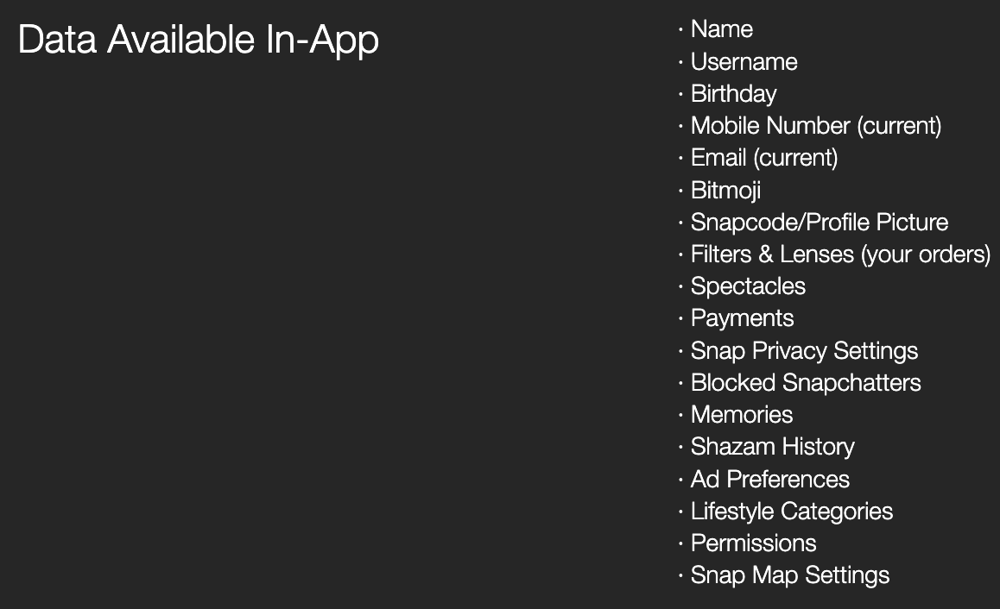
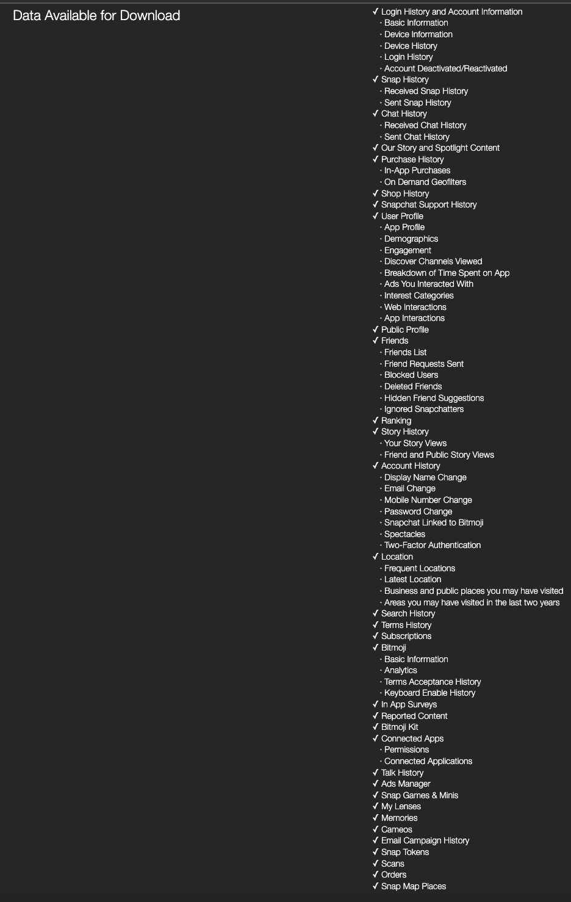
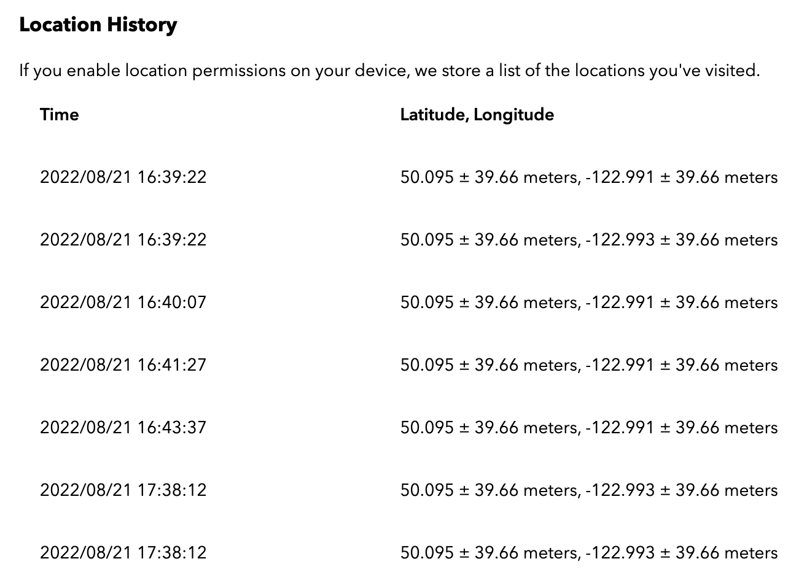

# Snapchat: _life’s more fun when you live in privacy_

## Authors

* Marco Caniglia (@mcanig)
* Sebastian Cobuzzi (@scobuz)
* Gregory Pope (@gpope)
* Nika Prairie (@nprair)

## Abstract

Snapchat is a social media platform which aims to ingrain itself deeply in its users lives, encouraging them to "live in the moment" and assuring them that anything they share on the platform will disappear forever. However, upon digging deeper into the platform's approach to privacy it quickly becomes clear that it is using this appearance to gain accesses to highly detailed personal data in order to productize its userbase. Snapchat feigns concern over privacy with rich privacy support material (which still leaves a privacy concious user with many questions), but avoids costly efforts which would improve the security of the data it handles. It seems the company wishes to placate its critics without losing access to a very valuable data mine.

## Introduction

Snapchat is a popular mobile application that allows users to share pictures and videos, known as 'snaps', with friends and followers. The unique feature of Snapchat is that these snaps disappear after a set period of time, ranging from one to ten seconds when sent to another user or 24hrs when posted as a 'story'. In its early beginnings, Snapchat gained a lot of popularity among younger demographics due to its innovative features such as filters, which allowed users to enhance their snaps. The perception that data shared to snapchat is viewable only temporarily to a list of 'friends' the user controls has led to users frequently sharing content on the platform they likely would not post somewhere they considered more permanent. Since its inception, Snapchat has continued to introduce features reflecting its corporate slogan "life’s more fun when you live in the moment", encouraging users to share what they're doing as they do it (perhaps best exemplified by the introduction of live location sharing with the 'Snap Map').

Snapchat clearly handles a plethora of personal data from its users, but the platform is built around (and popular because of) a concept of ephemeral sharing. This focus (and the question of whether all this data is truly ephemeral) makes Snapchat an exceptionally interesting platform for privacy analysis.

## Research Methods

* Literature search
* Policy review
* Action research
  * Group members requested a download of stored data from Snapchat via the [Download My Data portal](https://accounts.snapchat.com/accounts/downloadmydata)
  * A new account was created to check for privacy notices, verify default configurations, and test different behaviours

## Features and terms

* Snap
  * The name of the company which develops Snapchat, sometimes used interchangeably with Snapchat.
* Snaps
  * Videos and images which can be annotated with text and images.
    * Image annotations are commonly called stickers.
  * A snap has a viewing window which can be limited to 1-10 seconds or left unlimited. Upon closure, once the viewing window has ended, the snap is deleted (unless Replayed).
  * The sender is able to see when the recipient has viewed their snap.
* Lenses
  * Lenses are filters, overlays, or other visual modifiers which can be used in the creation of a snap.
  * Many lenses rely upon object recognition.
* Memories
  * A snap may be saved before it is sent, it can be saved as a memory on Snapchat's servers to be accessible anywhere the account logs in.
  * My Eyes Only
    * This is a subsection of memories which is locked by a password.
* Replay
  * After a user has closed a snap, they they have a brief window where they can replay it, restarting the viewing window and reopening the snap.
  * If a recipient replays a snap the sender will receive a notification and an entry is added in the users' conversation to record the behaviour.
* Chats
  * Messages between users; generally text, but may also be an image or video which has not been made into a Snap.
  * The log of chats between 2 or more users can be seen as a conversation. A given conversation can be configured to delete chats upon dismissal or after 24hrs.
    * In a conversation any user can save any chat before they dismiss it or it disappears. Saved chats will be visible to all users in a conversation and can be unsaved by any user (resulting the their deletion).
* Story
  * A Snap which is posted for a 24 hour period, visible to a group of users depending on the poster's privacy settings.
* Adding users/friends
  * A user can add another user, allowing them to quickly see content they share publicly. If the user adds them back, these users become friends.
  * Users can be added by searching for their username or through the Find Friends page which finds users to add based off the phone numbers and emails in the user's device's contacts.
* Snapstreak and Friend Emojis
  * Two uses will have a snapstreak if they send each other snaps every day, this is indicated with an emoji on their conversation and a number to count how many days the snapstreak has lasted.
  * Depending on how often two users send snaps to each other, they may become Best Friends indicating they communicate frequently. BFs are indicated with an emoji next to their name in your list of friends, there are a number of different emojis for other conditions relating to your best friends status for each other[^emojis].
    * When the platform was originally rolled out, any user could see any other user's list of Best Friends, but this public display has been removed[^bfList].
* Snap Map
  * A map showing the location of the user and their friends.
  * Location tracking (once enabled) remains active in the background once the app is closed.
  * Users can submit snaps to be accessible from the snap map at their current location.
    * A heatmap is overlaid on the map indicating how many snaps have been shared in a particular region. Tapping on the snap map will show snaps shared in the are tapped.
  * Ghost Mode
    * When a user enables ghost mode their location will no longer be updated for their friends.
* Snapscore
  * This is a score visible on every user's profile to their friends, it increases as the user sends snaps and posts stories.
* User activity notifications
  * If a recipient screenshots or screen-records a snap or chat conversation, a notification is sent to the sender and an entry is added in the users' conversation to record the behaviour.
  * A watching user can see many actions by another user in a shared conversation.
    * A watcher can see when a user is typing.
    * A watcher can see when a user is viewing the conversation.
    * A watcher can see when a user attempts to partially slide open the conversation in an effort to avoid marking it as read.

## Snapchat's Privacy-Sensitive Processes

### 1. **Geolocation Tracking**

In June of 2017, Snapchat launched their location-sharing feature called "Snapmap". This real-time map allows users to share their current location with anyone in their contact list when they are on the app. Snapchat gave its users the choice to share their location with all of their friends, a few friends they selected or disappear from the map by going into "Ghost Mode" or not opening Snapchat for a few hours. There are many reasons why this geolocation feature is a risk for users privacy; here are some of the more glaring reasons.

* First of all, constantly revealing your location to anyone in your contact list is a risk because you are possibly revealing your home address, work address, and other places you visit frequently. Revealing such information can be risky as one might not be aware exactly who is in their friend list. This can allow stalkers or people with bad intentions to monitor your location.
* Secondly, Snapchat shares your geolocation data to companies who may be interested in gaining such information in order to target their ads more efficiently. These businesses thus obtain sensitive information about the user such as their interest, hobbies, favourite places to go, etc.
* Lastly, the risk for a data breach is quite alarming. If anything were to happen and Snapchat leaks Snapmap data, your geolocation could be shared to millions of people putting you at risk of harassment, stalking, or any other form of privacy invasion. This can be very worrisome for people who have a large following such as celebrities, athletes, etc.

### 2. **Camera Access, Filters and Facial Recognition**

Snapchat being a camera-based social medial, inevitably requires access to your devices camera. However, on top of having access to your camera, Snapchat prompts the user to give access to their camera roll to save snaps to their mobile device. This comes at a high risk because it means Snapchat potentially has access to any photo or video saved on your device. Thus giving Snapchat access to such sensitive information is very risky to ones privacy as there are risks of data breaches which could reveal lots of private information. On top of having access to your personal photos and videos, Snapchat filters, which were introduced in January of 2015, use facial recognition technology to train their augmented reality models. Thus, another privacy concern of allowing Snapchat to access your devices camera is the potential storing of your facial features. Facial recognition is becoming a very popular way for businesses to identify their users. Thus allowing Snapchat to use your facial structure and features outside of an authentication context is a potential risk to your privacy.

### 3. **User Data Collection**

Snapchat collects a lot of personal data about its users. In addition to personal information such as Name, Username, Birthday, Mobile Number, Email, Profile Picture, Payments, which can all be found on the mobile app, Snapchat also stores a plethora of other information. This information includes, login history (containing location), snap history, chat history, friends list, ads you interacted with, web interactions, app integrations, account history, locations, search history, and much more. Handling this large quantity of PII is a serious risk to user privacy as any leak or exposure of this personal data could seriously harm the user in question.

### 4. **Third-Party Data Sharing**

Another significantly risky process Snapchat takes part in is selling your data with third-party partners. As mentioned in its privacy agreements, Snapchat shares your data to its "trusted" partners for various purposes. These partners include but are not limited to:

* Advertisement companies who use Snapchat's detailed data about your profile to show you advertisements about your interests, preferences, or locations you visit frequently.
* Analytical companies who process your data to better understand trends in your behaviour in order for Snapchat to improve their suite of features.
* Service providers such as cloud storage providers.

### 5. **Snapping & Messaging**

The final privacy-sensitive process is at the core of their application; messaging between users. The communication between any two users of the platform must be secure, and Snapchat must ensure that no messages are being tampered with or read by eavesdroppers. It is important to note that Snapchat does not offer end-to-end encryption for all of its features, and the  “chat” feature is not one of its encrypted features. This means that Snapchat can view the contents of messages sent between users. In addition, Snapchat retains copies of all messages sent through the chat feature for a limited time, which is a risk to user privacy.

## Fair Information Practices

### Notice Practice

Snapchat attempts to respect the principle of Notice by presenting links to resources where a concerned user (e.g. the authors of this paper) could investigate what and how data is collected and for which purposes. This is likely adequate notice from a legal perspective, however it fails in the spirit of the principle. Snapchat does not make significant effort to encourage or ensure the user takes the time to understand the privacy implications of using the platform.

Privacy policy and terms of service links are presented on the first page of the sign up process.

The first time a user opens the Snap Map they are presented with a prompt to enable location access which includes a generic outline of the ways in which the data may be used.

Whenever a user attempts to post a story they are given a prompt which reminds them the snap will be accessible to a large group of people for an extended period of time, the language of the prompt does not change depending on the users story visibility settings.

Aside from these notices, there are many behaviours of which users are not given advance notice. For instance the snapscore, which is visible to your friends, exposes real-time information about a user's activity on the app; a user has to navigate to their profile and tap on their own score to obtain an understanding of its existence and what it represents.

The user is also not notified that screenshots and snap replays will result in a notification to the sender until after they (or someone they are corresponding with) have done one of these actions and an entry is added in the conversation history to reflect this.

The most significant failure of notice comes from Snapchats storage of data. Requesting collected user data reveals a shockingly long log of user activity including 2 years of location data. A note in the data download indicates most logs are retained for 180 days, but some may be retained longer. The depth and length of these logs are far greater than a user is likely to assume from the privacy policy[^privacyPolicy].

### Choice Practice

Snapchat provides the user strong controls over the use and sharing of their data, inline with the principle of Choice; however, it is unclear (and seems unlikely) whether these controls affect collection which should remain a concern for users. In the Snapchat app, it is reasonably easy for a privacy concious user to find the settings page which contains a privacy control section. This section contains sub-pages for managing most aspects of how their personal information is handled.

#### **Sent content**

When creating a snap the user has the opportunity to save their creation before it is sent, the user has control over where this content will be saved. The user may choose to save the snap to their local device or to Snapchat's servers (in their memories), or to both locations. By Default snaps will be saved to Snapchat's servers.

Once a chat or snap is sent, the sender may attempt to delete it from the conversation history. If they do this quickly and Snapchat's servers are able to contact the recipient's device before they have accessed the content, the sender can effectively cancel the sending of the content. In this way a user retains the choice to revoke access to the content.

However, if the content does reach the recipient's device and the sender does not delete it, the recipient now has some abilities which the sender cannot control. In the case of a chat, the recipient can save the chat in the conversation, thus extending their access to its content; the sender cannot disable the ability to save chats, but they can engage in a form of stand-off and ensure the recipient leaves the conversation screen without saving the chat. In the case of a snap, the recipient will have a short window of opportunity to replay the snap after it is closed; replays also cannot be disabled by the sender, though they wil be notified.

Sending content also results in updating a user's snapscore which is visible to all friends and for which there are no privacy controls.

#### **Stories**

Stories have 3 levels of visibility: public, all friends, specific friends. When set to public, a user's story can be viewed by any user who searches for their account and will appear under a 'Subscriptions' section for any user who has added the poster, but hasn't been added back (thus making them not a part of the poster's friends). The default setting of story visibility is to all friends.

#### **Location**

The Snap Map is a major privacy concern for many users. Thankfully, users have control over who can see their location under the `My Location` sub-page. One can choose to allow all their friends to see their location, prevent specific friends from seeing their location, or specify a specific list of friends. Further, a user can enable 'Ghost Mode' which prevents any other user from seeing their location, however it is unclear if Snapchat continues to collect location data for internal or marketing purposes. The users location continues to update on the Snap Map on their own device while in Ghost Mode proving that location tracking is not entirely disabled.

#### **Ads**

Under the `Ads/Ad Preferences` sub-page, Snapchat provides the ability to opt-out of 3 independent advertisement targeting methods[^adPrefs]: audience-targeting, activity-targeting, and third-party ad networks. Reasonably detailed descriptions as well as links to learn more are included. The following is paraphrased from this page. Audience-based ads are targeted to groups with a common interest, music or food preference for example. Activity-based ads are targeted based on behaviour outside of Snapchat, e.g. after searching for a movie online a user is served ads for similar movies. ads served by third-party ad networks are targeted based on a profile the network has curated; Snapchat sends the network some data to identify or categorize you and the network selects ads based on your profile.

### Access Practice

Snapchat does a good job of respecting the Access principle.

Snapchat makes it very straightforward to retrieve data collected through their data download portal. Some basic profile information (name, username, email, phone humber, ad preferences, permissions, etc.) is available directly within the app, but the ZIP file obtained from a data request appears to contain data from all the categories Snapchat claims to collect in their privacy policy[^privacyPolicy]. This data is well categorized and easy to navigate; it's formatted as a webpage you can open and navigate entirely locally with your browser, making the data which is otherwise provided in JSON format accessible to even non-technical users. This data download can optionally include a user's memories; of the downloads we reviewed, none of the images or videos included were ones we otherwise expected to have been deleted. Notably the download omits the content of the password-protected 'My Eyes Only' section of memories, from a user perspective this (along with Snapchat's claim resetting the passcode will result in losing the protected content[^myEyesReset]) suggests these images are encrypted such that they cannot be viewed without the password and Snapchat does not have a 'backdoor' to this.

A key aspect of providing users with Access is the ability to correct and delete information. User-specified personal details (name, birthdate, email, phone number, etc.) are all easily updatable (with some restriction on fields which aren't expected to change frequently, like birthdate). Additional details such as device and location information are updated automatically; this comes with its own concerns, but is a positive behaviour from the perspective of data-correctness. Data deletion is handled well for content such as chats and memories which can easily be un-saved in the same place they can be accessed. There is some personal information which is required to create an account[^acctCreate] and cannot be deleted during the lifetime of the account, however Snapchat has a straightforward account deletion process[^acctDelete] and claims all data except that which is required for "legal, security, and business needs" will be deleted after a 30 day reactivation window.

### Security Practice

Snapchat has made some strides to respect Security, but the company's behaviour suggests it is only a concern so far as it might increase their public appeal (and thus their revenue).

As noted while discussing the principle of Access, it appears Snapchat has made appropriate design choices to ensure that a user's My Eyes Only is only visible to them. Additionally, Snapchat claims they do not retain snaps or chats longer than required[^snapDelete]; deleting them after they are viewed by all recipients or after a grace period if they go unopened (31 days for 1:1 chats, 7 days for group chats), or after the viewing period ends for stories and chats with an extended viewing period. Snapchat also introduced end-to-end encryption in later 2018[^e2ee], but only for Snaps between individuals (text chats and the contents of group chats are not encrypted end-to-end). At the time of this introduction, Snapchat claimed end-to-end encryption would be expanded to cover all communication formats on the platform[^textEncryption], but as of the time of writing this has not been implemented.

Snapchat has had a number of data breaches[^breachList]. Most occurred as a result of phishing attacks or attacks on third-party companies receiving data from Snapchat, both of which are difficult to ensure protection from. The greatest true failure in security occurred in 2014 when an exploit in the platform's 'Find Friends' feature allowed the discovery of accounts linked to any phone number, resulting in the exposure of 4.6 million users' data[^2014Breach]. Adding to the severity of this breach, Snapchat was dismissive when first presented with the exploit and failed to meaningfully address it in a timely manner[^breachResponse]. More recently, the platform has faced a breach not as a result of technology, but rather policy. Snapchat maintains an internal tool, originally developed for use in cooperating with law enforcement, which allows employees to access user data which is otherwise private to the user. In 2019, former employees of Snapchat came forward to reveal the existence of this tool[^snapLion] and the lack of control or monitoring of its use which reportedly allowed numerous employees to view private user data for illegitimate reasons.

## How data is transferred, stored, and processed

### Data transfer

The following table summarizes and elaborates on all data transfers that occur within the user’s sphere. In this case, we are looking at data transfer from the user’s device to Snap Inc. servers.
| **Type of data transfer**                                                    | **Is this data user generated or recorded automatically?**                                | **Is this type of data transfer implicit or explicit?**                      | **Is this data transfer a privacy concern?**                                                                                                                                                                                                                              |
| ---------------------------------------------------------------------------- | ----------------------------------------------------------------------------------------- | ---------------------------------------------------------------------------- | ------------------------------------------------------------------------------------------------------------------------------------------------------------------------------------------------------------------------------------------------------------------------- |
| **Usage Information (user interactions with services or other users)**       | Recorded automatically.                                                                   | Implicit.                                                                    | If transferred to third parties. There is a surveillance concern here too.                                                                                                                                                                                                |
| **Content Information**                                                      | User generated (the user creates the content on Snap services).                           | Implicit.                                                                    | No. The type of content referred to is not PII (ex: custom stickers).                                                                                                                                                                                                     |
| **Device Information (hardware model, OS version, IP address, …)**           | Recorded automatically.                                                                   | Implicit.                                                                    | Generally, the information collected under this category is standard. However, like much data, it can be dangerous if this data is in the hands of a malicious party.                                                                                                     |
| **Device Phonebook (contacts on user’s device)**                             | Recorded automatically (contacts are already on device).                                  | Explicit. User permission required.                                          | Potentially. Snap should look to only access the least amount of info. Their reason for collecting all contacts is to connect users by contact.                                                                                                                           |
| **Camera, Photos and Audio**                                                 | Recorded automatically.                                                                   | Explicit. User permission required.                                          | No because it’s an explicit transfer.                                                                                                                                                                                                                                     |
| **Location Information**                                                     | Recorded automatically.                                                                   | Implicit for approximate location. Explicit for precise location.            | No because the approximate location is not enough to locate user. Also, on first entry, the user must give permission regardless of if it’s an approximate or precise location.                                                                                           |
| **Information collected by Cookies and Other Technologies**                  | Recorded automatically.                                                                   | Implicit. However, in most cases, user can remove or reject browser cookies. | Somewhat. Snap should look to only collect the least amount of information, necessary information. Also, given the default setting is to have this option on, it can cause users to lack trust in the system since their intentions are not clear (lack of transparency). |
| **Log Information (access time, pages viewed, …)**                           | Recorded automatically (this type of data is constantly being recorded when app is open). | Implicit.                                                                    | If transferred to third parties. There is a surveillance concern here too.                                                                                                                                                                                                |
| **Information collected from other users, Snap affiliates or third parties** | Recorded automatically.                                                                   | Implicit.                                                                    | There is a privacy concern however since the data is already in the hands of a third party, data collection happens outside the scope of Snap. Implicit data transfer between companies is always cause for concern however.                                              |

### Data Storage

Snapchat currently uses cloud storage through a third party, Amazon Web Services (AWS), to store user data. When the application was launched in 2011, Snapchat used a cloud-native, monolithic architecture.  However, given its lack of scalability, they no longer have a monolithic architecture in place. There are currently over 5.4 billion Snaps sent daily, so this architecture system needs to be performant with this data set size[^aws].

#### Data storage in the context of the user sphere

The user sphere, in this case, is the Snapchat user’s device that they are accessing their account. The only forms of storage in this sphere are saved Snaps and Memories (see Persistent Data Storage for further explanation of these features).

* Saved Snaps are stored in the chat conversation that the user sent or received the Snap in. Users can view these saved Snaps anytime by going to the conversation; they cannot be accessed anywhere else in the application.
* Memories are stored in the user’s Snapchat account. Users can view these Memories anytime by sliding up on the app’s main interface. Snapchat also sends users their Memories saved in past years on their anniversaries.

#### Data storage in the context of the recipient and joint sphere

The recipient sphere in this context is Snapchat Inc., while the joint sphere includes third party organizations that Snapchat works with. The following is a classification of the data stored by Snapchat Inc. as persistent or transient[^dataStorageTime].

**Persistent Data Storage**

Snapchat’s model has always been deleting by default. Meaning most messages, photos and videos are automatically deleted once they’ve been viewed by the recipient or expired. They initially gained popularity as this was, and still is, a unique feature in the social media market.
This means that there are few instances where Snapchat uses persistent data storage:

* Saved Snaps and Chat: Both the sender and receiver can save a Snap or Chat by pressing and holding on it. Saved snaps are stored on Snapchat’s servers. The user must save the Snap while viewing or directly after viewing it; once the chat conversation is closed, the user can no longer save it. Note that only Snaps with photos with no time limit and videos set to infinite loop can be saved (users can set a timer on photos and a number of loops on videos)[^saveSnap]. Users can also delete a Snap in chat by pressing and holding on it and clicking ‘Delete’. Once a saved Snap is deleted from the user’s conversation, Snapchat will set to delete it from their servers. They also claim that they attempt to delete it from their friends’ device however, it does not always work due to an old version of Snapchat or a bad internet connection.
* Memories: Users can save photos and videos sent through chat or posted as Stories to their Memories. Once saved as a Memory, Snapchat stores it in their server. Snapchat claims their servers are designed to remove Snaps as soon as possible if the user deletes them from their Memories.
* Basic account information such as name, phone number, email address and friends list. The user can ask to delete the data associated with their friends list.

Snapchat stores Snap’s and Chat’s metadata when saved in chat or Memories. The metadata includes information such as date, time, sender, and receiver. Snapchat claims that the content of the Snap or Chat is not included in the metadata. However, the metadata we accessed from our personal profiles includes the content of Chats, showing a discrepancy from their privacy statement[^snapMetada].

**Transient Data Storage**

As mentioned above, much of the data stored by Snapchat is transient:

* Snaps: Note that these are not Saved Snaps. Snapchat’s servers are designed to delete Snaps once one of the following is true:
  * The Snap was viewed by all recipients (and not Saved in Chat).
  * The Snap was unopened after 31 days for a one-on-one conversation.
  * The Snap was unopened after 7 days for a group chat.
* Chats: Note that these are not Saved Chats. Snapchat’s servers are designed to delete Chats once one of the following is true (Note: If a Chat is saved, replied to, or reacted to, then the following conditions don’t apply):
  * 24 hours have passed since the Chat was viewed for a one-on-one conversation. Users can modify their settings to delete Chats right after viewing, however.
  * 24 hours have passed since the Chat was viewed by all recipients for a group chat. Users can modify their settings to delete Chats right after viewing, however.
  * The Snap was unopened after 7 days for a group chat.
* Stories:  Snapchat servers are designed to delete Stories 24 hours after they are posted. Users can delete a Snap from their Story at any time.
* Location data is stored for different lengths of time depending on the services used and if the user shares their precise or approximate location. If location data is associated with a Memory, then Snapchat would store the location as long as the Snap is stored. This edge case would fall under persistent data storage. Snapchat also claims that it can identify user's most frequently visited locations, businesses or public places.

Note on what Snapchat means when they say their servers are _designed_ or _set to_ delete data. From their privacy statement, “while our systems are designed to carry out our deletion practices automatically, we cannot promise that deletion will occur within a specific timeframe. There may be legal requirements to store your data, and we may need to suspend those deletion practices”.

### Data Processing

Snapchat claims that user data is processed to give the user a better experience. They also claim that the app works as well as it does thanks to their collaborations with third party organizations. The third parties usually fall into one of these main categories: Advertising, storage, data providers, e-commerce, maps, marketing and payment[^3rdParties]. For example, they collaborate with third parties to add features to Snapchat. They must share data with these entities so the feature can function correctly. Some of these include DoorDash, Google Maps and Shazam[^3rdPartiesFeatures].

The following table illustrates all of Snapchat’s data processing usages[^dataProcessing]:

| <!-- -->| <!-- -->  |
| --- |---|
| **Feature development** | Snapchat develops new features or improves existing ones based on user interactions on the application. User trends can be found with this data and used to maximize the performance of features.                                                                                                                                          |
| **Operations**         | Personal data is used to optimize performance; in this case, we refer to device info such as the operating system or camera. For example, to ensure the application is performant when a new version is released, Snapchat uses device info to determine where issues are being produced.                                                  |
| **Personalization**    | Snapchat uses personal data to tailor user experiences. They personalize ads, searches, Snap Filters, Snap Map and Lenses. They also use information so users can personalize their snaps based on their location, weather or special filters for specific events. The Discover page of Snapchat is also firmly based on users’ interests. |
| **Security**            | Personal information is used to enhance security aspects related to the application. For example, two-factor authentication to secure an account. They also use email or text messages (phone number) when there is suspicious activity on an account. Snapchat also warns users when URLs sent on their services are potentially harmful. |
| **Advertising**         | User interactions are used to identify relevant ads for a user. They also use this info to ensure that ads that do not apply to a user are not shown.                                                                                                                                                                                      |
| **Contact**             | Snapchat uses email and phone numbers to contact users when significant features are released when they request a copy of their data or reset their password.                                                                                                                                                                              |
| **Legal implications**  | This category of data processing is done for legal reasons.  This can come into play when Snapchat needs to enforce their terms and policies, for example, there is unlawful content posted on the application. Snapchat may also need to share personal data with law enforcement or to comply with legal obligations.                    |

## Refined Description

### PIIs transferred, stored and processed

The following are PIIs which are transferred, stored and processed in Snapchat:

* First and last name
* Email
* Username (changeable once a year)
* Phone number
* Birthdate
* List of friends
* Optional:
  * Profile picture
  * Mobile phone contacts
  * Location

## Actors and their interactions

### Actors

1. **PII principals**: The PII principal in the case of Snapchat are the users of the application communicate with other users through photos, videos, and messages.
2. **PII controllers**: The PII controller would be Snapchat Inc. They are responsible for ensuring the user’s PII is managed in accordance with privacy laws.
3. **PII processors**: The PII processors of Snapchat include data analytics, management and solution providers. Snapchat states that they process user data in the United States and other countries outside of where the user lives.
4. **Third parties**: Third parties that Snapchat works with include but are not limited to advertising partners, cloud storage providers, data providers and marketing partners (See full list under Data Processing). They use cookies, web beacons, web storage and unique advertising identifiers to collect information about user activity, browser, and device.

### Interactions

* A Snapchat user (PII principal) provides PII such as their name, email address, phone number and birthday to Snapchat Inc. (PII controller) when creating an account.
* Other interactions include implicit and explicit data transfer between the PII principal and controller (see Data Transfer). Users agree to these terms of use when creating an account (except for the explicit transfers).
* There is also an interaction between users (PII principals) that must be considered. Users transfer data through Snaps and Chats sent to each other (or in Group Chats with more than two PII principals). Users also interact by sharing each other’s location with Snap Map and by posting Stories to be viewed by all users on their friends list.
* Snapchat Inc. (PII controller) is responsible for ensuring that user data is processed in accordance with the applicable privacy laws. Since they give PII processors access to the user (PII principal) data, the PII processor must work by the PII controller’s protection standards to process user data securely.
* Snapchat Inc. (PII controller) gives third parties access to user data. Like PII processors, Snapchat Inc. must have policies to protect user data when passed onto the hands of third parties. They also limit the data provided to third parties to ensure user privacy and that only the required data is transferred

## 11 Privacy Principles

### Consent & Choice

As mentioned in the [Fair Information Practices](#notice-practice) section, Snapchat does indeed offer a Privacy Policy and Terms of Agreement upon creation of a new account, thus providing a baseline level of consent and choice to its users. However, we argue said consent and choice is only a mere tactic to satisfy legal requirements. Snapchat's very verbose Privacy Policy shown to users upon account creation lacks conciseness and the information cannot easily be understood by the average user. The fine-print of their sign up page also implicitly "checks" the Privacy Policy and Terms of Agreement meaning it is not guaranteed that users have read the agreement and understood any of its content.

We further argue that they do not completely adhere to the **consent** principle because there is little explanation provided to PII principals about the implications of granting consent. In terms of data processing, PII principals are not given notice about where their data will be sent and who the third-parties gaining access to this personal information are. Furthermore, there is no way for a user to customize the extent of consent they can give to Snapchat based on how comfortable they are with revealing their personal information. Meaning, the user cannot "select" which or Snapchat's "trusted" parter has access to their information. In turn, the PII controller does not completely adhere to the choice principle because they do not change the implementation aspects of the application based on the principal's privacy preferences.

### Purpose Legitimacy & Specification

| Adhering to the purpose legitimacy and specification principle means | Our Verdict |
| ------ | ------ |
| Ensuring that the purpose complies with applicable law and relies on a permissible legal basis |  Within Snapchat's _**Business Help Center**_, there are details about Snap following privacy practices that align with the GDPR.      |
| Communicating the purpose to the PII principal before the time the information is collected or used for the first time for a new purpose | As shown above, the first time that a user uses the [map](images/map_notice.jpg), [story](images/story_notice.jpg), and other features on the app do warn the user about the use of their data, however we do not believe they are being as transparent as they should be, and the messages lack depth. |
| Using language for this specification which is both clear and appropriately adapted to the circumstances | We believe that the language is not very well adapted to the average user. In addition, the **Privacy and Security** section of Snap's Business Help Center is very convoluted and has a lot of hyperlinks pointing to many different places but do not demystify the privacy aspects of the company and what data they are storing and for what reasons |

In turn, we believe that Snapchat partially complies with the principle of Purpose, Legitimacy and Specification; however it falls short on certain fronts.

### Collection Limitation

As mentioned previously, Snapchat allows users to request the data that the company has stored about them. In turn, users have access to all the data points stored, and are exposed to the truth behind Snap.  
Here is the list of all the personal data Snapchat stores about its users:

It can be observed, upon requesting one's data, that Snapchat saves the precise geolocation of every single saved Snap memory one took on their account. Furthermore, a users geolocation is tracked and saved for over 2 years on Snapchat's servers, as it can be seen here:

Although Snapchat claims it stores a users geolocation for "Filters and Ads", this level of location tracking is excessive and seems unreasonable for their claimed use.
Thus, we believe that Snapchat does not comply with the Collection Limitation Principle.

### Data Minimization

| Adhering to the data minimization principle means | Our Verdict |
| ------ | ------ |
| Minimize the PII which is processed and the number of privacy stakeholders and people to whom PII is disclosed or who have access to it |  Although Snapchat admits to sharing PII with partners who will process a user's PII and put it to use, it does not provide a list of such partners/sub-processors, which is very alarming to users. Snapchat claims their partners adhere to their privacy guidelines, but users are not given such evidence. |
| Ensure adoption of a “need-to-know” principle, i.e. one should be given access only to the PII which is necessary for the conduct of his/her official duties in the framework of the legitimate purpose of the PII processing | As seen above in the quantity of data retained by Snapchat, it can be said that Snap retains an alarming amount of information about its users and is this data may not be required for their partners to conduct their duties. For instance, advertisers may need access to a users current location of location visited in the past 24hrs in order to provide a tailored advertisement; however, the user's location 24 months ago has no effect on their current duty. As geolocation is considered a form of PII, we are lead to believe Snapchat does not respect the "need-to-know" principle. |
| Use or offer as default options, wherever possible, interactions and transactions which do not involve the identification of PII principals, reduce the observability of their behaviour and limit the linkability of the PII collected | Snapchat has implemented several measures to protect the privacy and security of its users' PII. One of these measures is pseudonymization, which is a data protection technique that replaces the identifying information of an individual with a pseudonym or alias. In Snapchat's case, the company uses pseudonyms to protect the anonymity of its users. For example, when a user signs up for Snapchat, they are assigned a unique username that they can use to identify themselves on the platform. Snapchat also uses this username to anonymize the user's PII data, such as their phone number and email address. |
| Delete and dispose of PII whenever the purpose for PII processing has expired; there are no legal requirements to keep the PII or whenever it is practical to do so. | As stated earlier, there are multiple instances where data is kept for an unnecessarily long period of time, which does not adhere to this standard. |

In conclusion, Snapchat has tried to separate the users from their geolocation and other data points stored, resulting in a higher adherence to certain privacy principles. However, we believe that overall it does not comply with the principle of Data Minimization.

### Use, Retention & Disclosure Limitation

In order to adhere to the Use, Retention, Disclosure Limitation principle, Snapchat must;

* Limiting the use, retention and disclosure (including transfer) of PII to that which is necessary in order to fulfil specific, explicit and legitimate purposes
* Limiting the use of PII to the purposes specified by the PII controller prior to collection
* Retaining PII only as long as necessary to fulfil the stated purposes, and thereafter securely destroying or anonymizing it

As we have seen in the last few sections, Snap retains some information for very long periods of time. The specific timeline for the deletion of user data may vary depending on the type of data and the purpose for which it was collected. For example, as mentioned in earlier section of this text, Snapchat deletes **unopened** snaps from its servers after 31 days, but it retains **saved** snaps indefinitely. It also stores geolocation for 180 days; meanwhile it does not specify how long it retains your voice call history for.
In short, it is not made clear by Snapchat which user information is stored for how long, which makes it hard to say if they comply with the Use, Retention, and Disclosure principle.

### Accuracy & Quality

| Adhering to the purpose legitimacy and specification principle means | Our Verdict |
| ------ | ------ |
| Ensuring the reliability of PII collected from a source other than from the PII principal before it is processed | To the best of our knowledge, Snapchat does not collect PII from a source other than from the PII principal. None of their documents state that this can occur. |
| Verifying, through appropriate means, the validity and correctness of the claims made by the PII principal prior to making any changes to the PII (in order to ensure that the changes are properly authorized), where it is appropriate to do so | When a user creates a new account, Snapchat sends a confirmation text message or email to the selected media which ensures the validity of the phone number or email the user has entered.|
| Establishing PII collection procedures to help ensure accuracy and quality | As mentioned in the previous point, Snapchat ensures their PII collection is accurate by sending confirmation emails and texts. |
| Establishing control mechanisms to periodically check the accuracy and quality of collected and stored PII | There is no clear indication on how often Snapchat prompts users to update information or if Snapchat has any procedure like this at all. However, from the perspective of a user, this rarely occurs.  |

Thus, for the most part, we believe Snapchat adheres to the Accuracy and Quality principle, although it could in-store (or improve an existing) mechanism to check accuracy and quality.

### Openness, Transparency & Notice

Snapchat provides very easily and clear accessible information with regards to how PIIs are used and with respect to how they are processed.[^privacyPolicy] This includes revealing which specific information is collected, which Snapchat splits into 3 major categories: information provided by the user when making an account, information obtained from using their services, and information collected from third-parties. They go further into explaining what sort of information they collect from using their services, and the usage for this information.

Any custom content created using Snapchat is collected, and device information is also collected. Such as: hardware and software, operating system version, device memory, advertising identifiers, time zone, and more. With permission your device phonebook is collected, camera and photo access as well.

Snapchat outlines the information which is collected from third parties and how they might use this information. Advertisers, app developers, and publishers may share information with Snapchat, which they might use to help target and measure the performance of ads.

### Individual Participation & Access

Snapchat gives its users the ability to access and review their personal identifiable information. This can be done so by going to their settings, where their PIIs are listed. This includes their name, username, birthday, mobile phone number and email.[^privacyPolicy]

A username may be changed, and amended once a year. First and last name can be changed or simply removed. A user's mobile phone number and email can be changed, as well as the ability to enable or disable being found by a user by using their phone number or email.[^privacyPolicy]

Users also have the ability to apply 2-factor authentication if they wish, which they can enable or disable at any moment through their settings on snapchat.[^privacyPolicy]

### Accountability

Upon entering Snapchat's website and scrolling to the bottom there is a link to the Privacy Center where all their privacy-related policies, procedures and practices can be found.[^privacyPolicy] Snapchat mentions in their outline on privacy that "We are not responsible for how those third parties collect or use your information.", which means they do not comply with the accountability principal from ISO/IEC 29100:2011, where it says to be properly adhering to the accountability principal, third parties must be bound to provide equivalent level of privacy protection.

Although they do not state that third parties are held to the same standard of privacy that Snapchat offers, they do provide a link to all the third-party services so that users may review these services separately and determine whether the level of privacy provided by these third-parties is adequate.

### Information Security

Snapchat has a log in functionality, so that users can control who may access their account, thus also controlling who has access to their PIIs listed on Snapchat. Even more security can be applied to ones Snapchat account to protect ones information by enabling the 2-factor authentication option in Snapchat's settings.

On Snapchats Privacy and Safety Hub[^privacyPolicy] they mention that they enhance the safety and security of their products and services by the information they collect from their users.

Snapchat outlines in their Privacy and Safety Hub[^privacyPolicy] that they may share information about a person for legal, safety and security reasons which could be to comply with legal process, government request, or applicable law, and also to protect the rights, property, or safety of its users or others.

This vague mention of possibly sharing PIIs in particular cases is a poor adherence to the guidelines specified in the ISO/IEC 29100:2011.

If a municipal councillor wishes to have users information and they have no legal right to request that information will Snapchat adhere to their outlined policies on privacy and share users information? Where is the line drawn with regards to Snapchat sharing a users information, given that their outline for sharing a users information is so vague.

### Privacy Compliance

Snapchat has a head of privacy engineering and data security, Subhash S.[^headPrivacy] This person is responsible for managing the privacy engineering and data security at Snapchat. They also have a Head of Global Platform Safety, Jacqueline Beauchere who is the companies first GLobal Head of Platform Safety.

This role focuses mainly on enhancing Snapchats overall approach to safety, this includes advising on internal policies, product tools and features. Snapchat applies privacy-by-design[^privacyByDesign] which means when new features are developed privacy and safety is considered in the design phase of features.

Snapchat also mentions on their site that they are completely compliant with the GDPR requirements and UK data protection laws. Requirements in Canada are very aligned with those of the GDPR, however it is unknown whether Snapchat operates in this manner internationally, or even in Canada.[^snapPrivacy&Security]

Snapchat has good adherence to the ISO/IEC 29100:2011 in terms of privacy compliance if the GDPR standards are upheld internationally.

## Conclusion

As the saying goes "if you're not paying, you're the product"; Snapchat leverages the trust its users may not even realize they have in the platform to collect and process highly detailed personal data with minimal scrutiny due to the assumption that all interactions with the platform are ephemeral. This data is used to increase Snapchat's value as an advertising platform and otherwise better productize its users. Snapchat is very aware of how it benefits from its reputation and so puts effort towards actions which give an appearance of concern for privacy (simple data access, accessible security console, detailed privacy documentation, etc.) without making steps to meaningfully improving security (global end-to-end encryption, limited user tracking, etc.). Overall, any Snapchat user should feel their privacy is threatened and (depending how much one trusts Snap's employees) already compromised.

## References

All figures and images were created or captured by our team.

[^emojis]:https://help.snapchat.com/hc/en-us/articles/7012335460372-What-do-my-Friend-Emojis-mean-on-Snapchat-
[^bfList]:https://www.distractify.com/p/how-to-see-other-peoples-best-friends-on-snapchat
[^adPrefs]:https://help.snapchat.com/hc/en-us/articles/7012345515796-How-to-Adjust-My-Advertising-Interest-Preferences-on-Snapchat
[^privacyPolicy]:https://values.snap.com/privacy/privacy-policy
[^myEyesReset]:https://help.snapchat.com/hc/en-us/articles/7012359362196-I-forgot-my-My-Eyes-Only-passcode
[^acctCreate]:https://help.snapchat.com/hc/en-us/articles/7012333136788-How-to-Create-a-Snapchat-Account
[^acctDelete]:https://help.snapchat.com/hc/en-us/articles/7012328360596-How-do-I-delete-my-Snapchat-account-
[^snapDelete]:https://help.snapchat.com/hc/en-us/articles/7012334940948
[^e2ee]:https://www.digitalinformationworld.com/2019/01/snapchat-end-to-end-encryption-users-media-messages.html
[^textEncryption]:https://www.youtube.com/watch?v=9xePC0Tyeuc&t=4547s
[^breachList]:https://firewalltimes.com/snapchat-data-breach-timeline/
[^2014Breach]:https://www.theverge.com/2014/1/2/5267784/snapchat-to-offer-security-fix-in-the-wake-of-leaked-user-data
[^breachResponse]:https://www.washingtonpost.com/news/the-switch/wp/2014/01/01/a-snapchat-security-breach-affects-4-6-million-users-did-snapchat-drag-its-feet-on-a-fix/
[^snapLion]:https://www.vice.com/en/article/xwnva7/snapchat-employees-abused-data-access-spy-on-users-snaplion
[^dataStorageTime]: https://help.snapchat.com/hc/en-us/articles/7012334940948?_ga=2.71455635.1079767334.1676757510-574102225.1674752981
[^saveSnap]: https://help.snapchat.com/hc/en-us/articles/7012377741332
[^snapMetada]: https://help.snapchat.com/hc/en-us/articles/7012318664852-About-Snap-and-Chat-Metadata
[^aws]: https://aws.amazon.com/solutions/case-studies/innovators/snap/#:~:text=Snap%20was%20born%20in%20the,minimize%20latency%2C%20and%20reduce%20costs
[^dataProcessing]: https://values.snap.com/privacy/your-information
[^3rdParties]: https://help.snapchat.com/hc/en-us/articles/7012351145364?_ga=2.240211971.1079767334.1676757510-574102225.1674752981
[^3rdPartiesFeatures]: https://help.snapchat.com/hc/en-us/articles/7012332511252?_ga=2.236673025.1079767334.1676757510-574102225.1674752981
[^headPrivacy]: https://www.linkedin.com/in/subhashsankuratripati/
[^privacyByDesign]: https://values.snap.com/news/meet-our-head-of-global-platform-safety
[^snapPrivacy&Security]: https://businesshelp.snapchat.com/s/article/snap-privacy-faq?language=en_US
